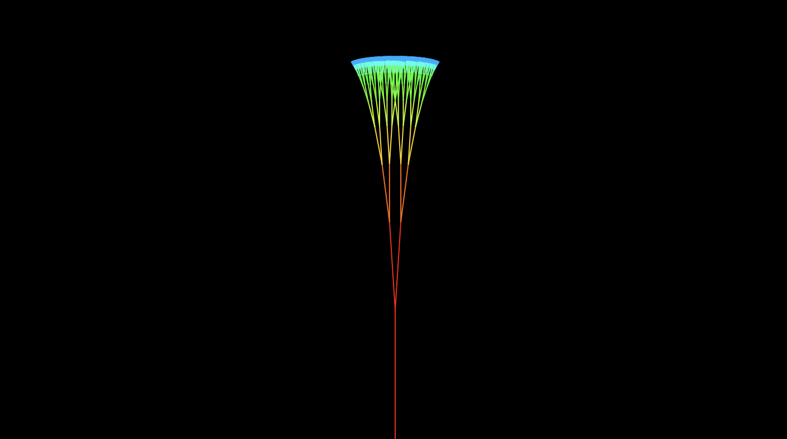
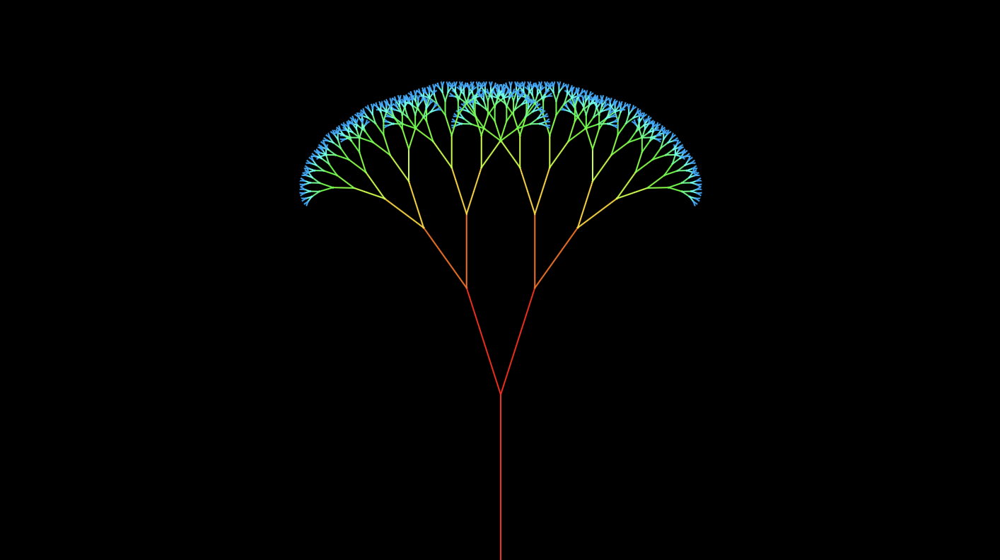
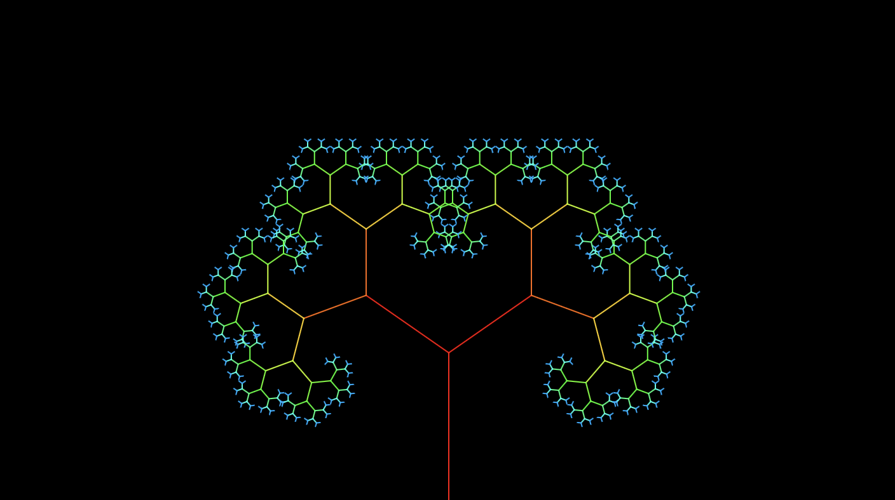

# Quiz_8
## Part 1: Imaging Technique Inspiration
[The video of the apple tree animation](https://www.youtube.com/watch?v=kYcIkOTqtcc)

**Inspiration Source: YouTube video** *"Growing Apple Tree Animation"*
-This animation vividly depicts the full life cycle of an apple tree—from sprouting and growing to blooming and bearing fruit—with natural and detailed visuals that are highly engaging. 
Since our project is based on Anwar Jalal Shemza’s Apple Tree artwork, I would like to incorporate a similar growth animation into the project. By simulating the tree’s growth and allowing 
users to interactively pick the fruit by clicking, the project can effectively combine visual appeal with user input functionality.

## Part 2: Coding Technique Exploration
[Recursive Tree-coding technique](https://p5js.org/examples/repetition-recursive-tree/)

-This recursive tree drawing coding technique uses recursion and dynamic angles to simulate the natural growth of trees. It is very suitable for simulating the growth process of apple trees, 
with branches growing and spreading, and then adding animations of fruit growth. It can help build a visually striking and interactive tree that fits both the artistic theme of the project and the goal of input interaction.

