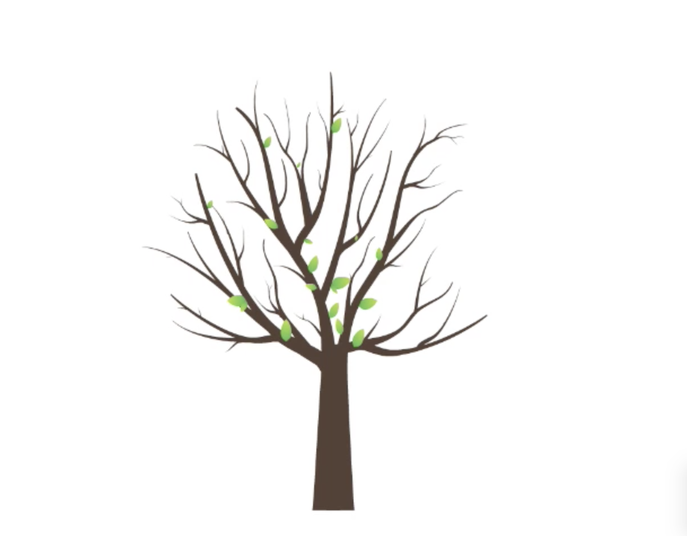
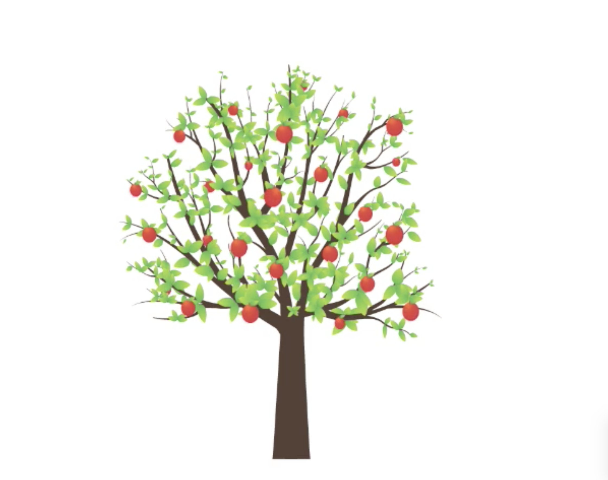

# Quiz_8
## Part 1: Imaging Technique Inspiration
**Inspiration Source: YouTube video** *"Growing Apple Tree Animation"*
-This animation vividly depicts the full life cycle of an apple tree—from sprouting and growing to blooming and bearing fruit—with natural and detailed visuals that are highly engaging. 
Since our project is based on Anwar Jalal Shemza’s Apple Tree artwork, I would like to incorporate a similar growth animation into the project. By simulating the tree’s growth and allowing 
users to interactively pick the fruit by clicking, the project can effectively combine visual appeal with user input functionality.

